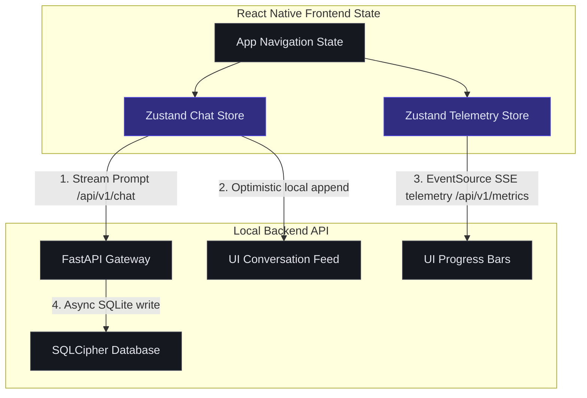
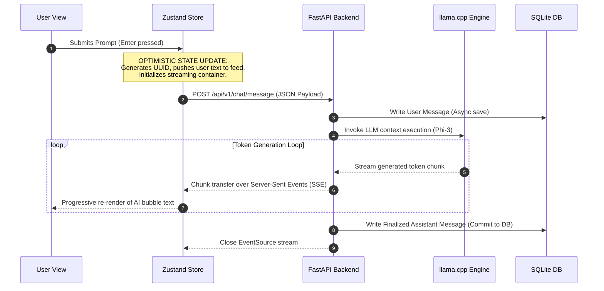
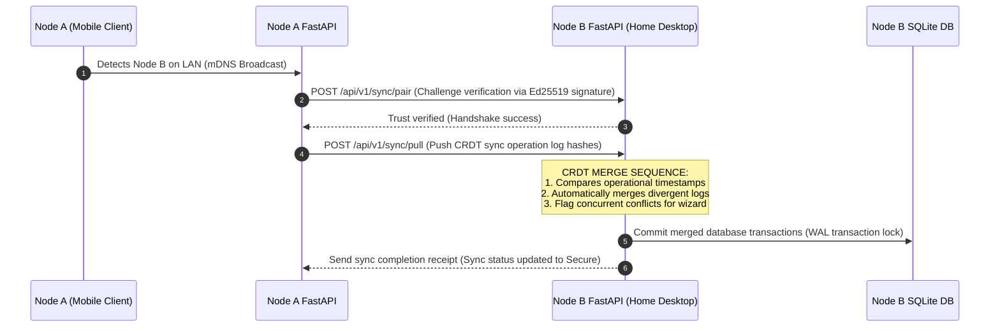

# Z-AI Chatbot V1.0 — Architectural Implementation Roadmap

This document serves as the authoritative architectural blueprint and step-by-step integration roadmap for wiring the **Z-AI Chatbot V1.0** React Native frontend components to the local **FastAPI + SQLite + llama.cpp** backend services.

The strategy is optimized for **controlled execution**, ensuring each subsystem is validated via isolated checkpoints before integrating higher-level layers.

---

## 1. Project Directory & Context Tree

The fully realized application will unify the existing React Native frontend files with a modular FastAPI service structure, organized as follows:

```text
c:/Farhan Ahmad/Code Languages/Mr. Z/Anti Gravity/AI Chatbot/
├── App.tsx                     # React Native Root Coordinator (State Navigation)
├── package.json                # Frontend package manifest
├── src/                        # React Native Core
│   ├── theme/                  # visual Tokens & Types (Quietly Intelligent Theme)
│   │   ├── types.ts
│   │   └── index.ts
│   ├── components/             # Reusable UI Components
│   │   ├── common/             # Brutalist 0px Buttons, Inputs, Cards
│   │   │   ├── Button.tsx
│   │   │   ├── Input.tsx
│   │   │   └── Card.tsx
│   │   └── chat/               # Chat Feeds & Hardware monitors
│   │       ├── ChatBubble.tsx
│   │       └── SystemMetrics.tsx
│   └── screens/                # Full Layout Screens
│       ├── ChatHomeScreen.tsx
│       └── DashboardScreen.tsx
└── backend/                    # FastAPI Local Backend Core (Python 3.12+)
    ├── main.py                 # FastAPI Gateway entry point
    ├── requirements.txt        # Backend dependencies
    ├── app/
    │   ├── api/                # REST Controller layers (V1)
    │   │   ├── chat.py         # Streaming inference endpoints
    │   │   ├── models.py       # Quantized GGUF management
    │   │   ├── sync.py         # CRDT peer pairing & pull/push mesh
    │   │   └── backups.py      # Encrypted local storage archive triggers
    │   ├── services/           # Authoritative Business Logic Engines
    │   │   ├── inference.py    # llama.cpp context loading & RAM scheduling
    │   │   ├── sync_engine.py  # Automerge/Yjs CRDT merge executors
    │   │   ├── crypto.py       # libsodium wrapper (Ed25519 & XChaCha20)
    │   │   ├── scraper.py      # Playwright safe sandboxed google scrapes
    │   │   └── backup_mgr.py   # Scheduled incremental zip compressors
    │   └── database/           # SQLite + SQLCipher PERSISTENCE layer
    │       ├── connection.py   # Encryption key derivation & WAL configuration
    │       └── models.py       # SQL Alchemy / SQLModel definitions
```

---

## 2. State Management Plan (Local-First Architecture)

Because Z-AI Chatbot is a **local-first** platform, state management must bridge the asynchronous SQLite database and local streaming execution loops, while keeping the UI responsive via optimistic UI updates.



### 2.1 State Framework Choice
*   **Recommendation:** **Zustand** (Lightweight, hook-based, excellent performance characteristics for high-frequency streaming inputs, zero boilerplate).
*   **Alternative:** Redux Toolkit (Only if corporate standards require exhaustive action logs, but overengineered for local FastAPI wrappers).

### 2.2 Global Store Topologies

#### 1. Chat Store (`useChatStore`)
*   **State Matrix:**
    *   `conversations: Record<string, ConversationMetadata>` (Active history catalog).
    *   `messages: Record<string, Message[]>` (Loaded log streams by UUID key).
    *   `activeModel: string | null` (e.g., `Phi-3 Mini`).
    *   `streamingText: string` (Buffer holding ongoing chunk streams).
    *   `syncQueue: SyncOperation[]` (Retry buffers holding locally written changes pending peer LAN merge checks).
*   **Actions:**
    *   `loadConversations()`: Pulls initial index list from local REST `/api/v1/chat/conversations`.
    *   `sendMessage(content)`: Appends immediately to local array (Optimistic Update) -> triggers stream query to backend REST -> updates `streamingText` on chunks -> saves finalized text to database.

#### 2. System Telemetry Store (`useTelemetryStore`)
*   **State Matrix:**
    *   `cpuUsage: number`
    *   `ramUsedGB: number`
    *   `ramTotalGB: number`
    *   `syncStatus: 'secure' | 'offline' | 'conflict'`
    *   `streakCount: number`
*   **Actions:**
    *   `initializeTelemetryMonitor()`: Initializes a background EventSource connection to backend Server-Sent Events (SSE) `/api/v1/metrics/live`, polling metrics once every 5 seconds to feed components (like `<SystemMetrics />`) without main thread blockages.

---

## 3. Data Flow Mapping

### 3.1 Streaming Local Chat Query Flow

Detailed pipeline tracing a user prompt through local execution:



### 3.2 Peer-to-Peer LAN Synchronization Flow (CRDT-Based)

Divergent log merge process when two user-owned trusted nodes connect:



---

## 4. Controlled Execution Roadmap (Step-by-Step)

The roadmap is divided into **5 sequential phases**. Each phase contains a strict exit criterion.

```text
 PHASE 1: persistence & Encryption Setup
 └── EXIT CRITERION: Database encrypted, WAL active, SQLCipher verified.
       │
       v
 PHASE 2: Local AI & Inference Core
 └── EXIT CRITERION: Phi-3 runs in llama.cpp, streams tokens via REST endpoints.
       │
       v
 PHASE 3: Frontend Integration & State wiring
 └── EXIT CRITERION: Zustand store connects inputs, optimistic message streams work.
       │
       v
 PHASE 4: LAN Sync & CRDT Engine
 └── EXIT CRITERION: mDNS pairing succeeds, databases merge divergent logs.
       │
       v
 PHASE 5: Backups & System Telemetries
 └── EXIT CRITERION: Scheduled backups run, live SSE metrics update dashboard.
```

### Phase 1 — Persistence & Encryption Setup
Build the absolute data foundation of the local-first application.

1.  **Configure Database engine:** Setup SQLite using SQLCipher bindings in python backend (`database/connection.py`). Setup WAL (Write-Ahead Logging) mode.
2.  **Encryption Key Derivation:** Write the Argon2id key derivation logic in `services/crypto.py` to securely convert user security PINs into 256-bit database encryption master keys.
3.  **ORM Mapping:** Build SQL Alchemy schemas matching the TRD Core table models (users, conversations, messages, models, sync_devices, sync_operations).
4.  **Security Sandbox Validation:** Assert that database files cannot be read without PIN validation (file reads must throw encryption faults).

### Phase 2 — Local AI & Inference Core
Wire the computational core of the AI Chatbot offline capabilities.

1.  **Install llama.cpp bindings:** Set up llama-cpp-python in backend services (`services/inference.py`).
2.  **Model Loading Manager:** Write context controls that dynamically load or unload quantized GGUFs. Enable RAM memory-budget checks before spinning up inference threads.
3.  **FastAPI REST Controller:** Implement `POST /api/v1/chat/message`. The response must support streaming text chunks progressively via standard HTTP `text/event-stream` headers (SSE).
4.  **Web Scraping Sandbox:** Setup a safe Playwright headless loop to scrap search queries and feed condensed summaries back to the LLM context.

### Phase 3 — Frontend Integration & State Wiring
Connect the React Native frontend layout screens to the Phase 1 & 2 backend endpoints.

1.  **Initialize Zustand Stores:** Implement `useChatStore` to manage conversation histories, active message feeds, and optimistic send statuses.
2.  **Wire ChatHomeScreen:** Connect `<ChatHomeScreen />` input elements to trigger chat queries. Ensure progressive streaming chunk updates map seamlessly into `<ChatBubble />` objects.
3.  **Build Model Controls:** Connect `<ChatHomeScreen />` header model dropdown with `GET /api/v1/models` and `POST /api/v1/models/load` APIs.

### Phase 4 — LAN Synchronization & CRDT Engine
Enable secure multi-device synchronization without centralized cloud layers.

1.  **mDNS Service Discovery:** Write local LAN node broadcast discovery routines to dynamically identify trusted sync devices in the local subnet.
2.  **libsodium Handshake:** Implement Ed25519 signature checks to securely verify node trust before sync payloads are exchanged.
3.  **CRDT Integration:** Write logic to serialise message history edits into Automerge/Yjs sync operations. Implement backend resolution systems to parse out-of-order logs.
4.  **Pairing UI Wiring:** Connect sync device registration screens with the P2P handshake controllers.

### Phase 5 — Backups & Telemetries
Polish system-wide telemetry analytics, manual configurations, and background jobs.

1.  **Telemetry Stream Setup:** Implement a periodic task inside the Python background framework (using APScheduler) monitoring CPU and RAM. Expose these via `/api/v1/metrics/live` (SSE stream).
2.  **Dashboard Screen Wiring:** Connect the `<DashboardScreen />` components to display RAM load, database volumes, storage segmentations, and achievements lists.
3.  **Automated Encrypted Backups:** Implement Scheduled Backup tasks saving zip snapshots (AES-256 encrypted) to local directories or USB mounts.

---

## 5. Critical Risk Matrix & Mitigations

| Risk Area | Architectural Impact | Developer Mitigation Strategy |
| :--- | :--- | :--- |
| **Local LLM OutOfMemory (OOM) Crash** | System memory exhaustion halts backend runtime, freezing React Native frontend screens. | 1. Implement RAM-aware models before loading (if system RAM is <4GB, block load of Mistral 7B and auto-suggest Phi-3 or Gemma 2B).<br>2. Run llama.cpp inside a sandboxed backend sub-process. If the process crashes, trap exit codes, release allocations, and send an OOM error status cleanly back to the client. |
| **Offline CRDT Log Merging Conflicts** | Divergent conversation modifications on two separate offline devices cause SQLite merge loops. | 1. Enforce LWW (Last-Write-Wins) timestamps for simple text metadata edits.<br>2. Build a rigid concurrent-conflict catalog in SQLite (`sync_operations`). If a deep conflict occurs, render a clean comparison view inside `<DashboardScreen />` to let the user manually confirm the preferred branch. |
| **Playwright Scraper Rate-Limiting** | Optional web-scraping queries trigger search engine captcha walls, locking execution threads. | 1. Wrap scrapers in async timeouts.<br>2. Throttle search volumes dynamically.<br>3. Implement a clean read-only fallback parser that strips snippets directly from standard markdown API mirrors if search captures fail. |
| **SQLCipher Storage Exhaustion** | Storage capacity failures throw unhandled database exceptions during active conversations. | 1. Implement transactional try-except traps across all Persistence write loops.<br>2. Run a background storage monitor job. When partition space is <5%, switch database connections to read-only status and trigger the storage warning banner immediately in `<ChatHomeScreen />`. |

---

## 6. Dependency & Software Assembly Order

To ensure a smooth, controlled execution path, developers should initialize dependencies in the following order:

```text
  LOW-LEVEL SYSTEM BINARIES
  1. Python 3.12+ & pip
  2. SQLCipher C libraries (database level)
  3. llama.cpp GGUF computational bindings
         │
         v
  BACKEND API FRAMEWORKS
  4. FastAPI service gateway dependencies
  5. libsodium & PyNaCl wrappers
  6. Playwright browser scrapers
         │
         v
  FRONTEND MOBILE WRAPPERS
  7. Node.js & React Native Expo CLI
  8. Zustand state engine package
```
