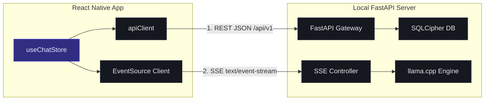

# Z-AI Chatbot V1.0 — Backend Integration Specification

This specification outlines the secure integration architecture, data transport schemas, service design patterns, error containment models, and security rules for wiring the **Z-AI Chatbot V1.0** React Native client to the local **FastAPI + SQLCipher + llama.cpp** backend services.

The design strictly avoids quick hacks, prioritizing local-first offline resiliency, memory safety, and stable streaming query threads.

---

## 1. API Connection Structure

To bridge the client and the FastAPI backend, we use a dual-channel communication model:
1.  **Standard HTTP Channel:** For transactional operations (History indexing, Model configurations, Backups, settings).
2.  **Streaming Channel (SSE):** For progressive local LLM token generation streams.



### 1.1 Type-Safe HTTP Client (`apiClient.ts`)
The client enforces request-response interception, injects derived PIN security tokens, and implements client-side retry policies for database-lock conflicts.

*Implementation Specification (`src/services/apiClient.ts`):*
```typescript
import axios, { AxiosError, AxiosInstance } from 'axios';
import { useAuthStore } from '../stores/useAuthStore';

const BASE_URL = 'http://127.0.0.1:8000/api/v1';

export const apiClient: AxiosInstance = axios.create({
  baseURL: BASE_URL,
  timeout: 15000,
  headers: {
    'Content-Type': 'application/json',
  },
});

// Security Interceptor: Injects the Derived PIN Session Token
apiClient.interceptors.request.use(async (config) => {
  const token = useAuthStore.getState().sessionToken;
  if (token && config.headers) {
    config.headers.Authorization = `Bearer ${token}`;
  }
  return config;
});

// Conflict Recovery Interceptor: Handles DB busy/locked codes optimistically
apiClient.interceptors.response.use(
  (response) => response,
  async (error: AxiosError) => {
    const config = error.config;
    if (!config) return Promise.reject(error);

    // If SQLite reports a database lock conflict, retry up to 3 times with backoff
    const errorData = error.response?.data as { error?: { code?: string } } | undefined;
    if (errorData?.error?.code === 'DATABASE_LOCKED' && (!config.headers['x-retry-count'] || Number(config.headers['x-retry-count']) < 3)) {
      const currentRetry = Number(config.headers['x-retry-count'] || 0);
      config.headers['x-retry-count'] = String(currentRetry + 1);
      
      const delay = Math.pow(2, currentRetry) * 500; // Exponential backoff (500ms, 1000ms, 2000ms)
      await new Promise((resolve) => setTimeout(resolve, delay));
      return apiClient(config);
    }
    return Promise.reject(error);
  }
);
```

### 1.2 SSE Stream Handler (`streamHandler.ts`)
Handles the progressive token streaming via Server-Sent Events (SSE). It parses token fragments and checks execution integrity.

*Implementation Specification (`src/services/streamHandler.ts`):*
```typescript
import EventSource from 'react-native-sse';
import { useAuthStore } from '../stores/useAuthStore';

interface StreamCallbacks {
  onChunk: (chunk: string) => void;
  onError: (error: any) => void;
  onComplete: () => void;
}

export const streamChatMessage = (
  conversationId: string,
  messageText: string,
  callbacks: StreamCallbacks
): (() => void) => {
  const token = useAuthStore.getState().sessionToken;
  const url = `http://127.0.0.1:8000/api/v1/chat/message?conversation_id=${conversationId}&message=${encodeURIComponent(
    messageText
  )}`;

  const es = new EventSource(url, {
    headers: {
      Authorization: `Bearer ${token}`,
    },
  });

  es.addEventListener('message', (event) => {
    if (event.data === '[DONE]') {
      callbacks.onComplete();
      es.close();
      return;
    }

    try {
      const payload = JSON.parse(event.data);
      if (payload.token) {
        callbacks.onChunk(payload.token);
      }
    } catch (err) {
      callbacks.onError(new Error('Failed to parse SSE payload'));
    }
  });

  es.addEventListener('error', (event) => {
    callbacks.onError(event);
    es.close();
  });

  // Returns cancel executor (to support "Stop Generation" hooks)
  return () => {
    es.close();
  };
};
```

---

## 2. Service Layer Pattern

The application decouples screens from persistence logic by introducing a strict **Service Layer** that translates API responses into typed domain entities.

```text
Screens  -->  Zustand Stores  -->  Services (e.g. ChatService)  -->  ApiClient / SSE
```

### 2.1 Chat Service (`ChatService.ts`)
Manages message indexing and conversation lifecycles.

*Implementation Specification (`src/services/ChatService.ts`):*
```typescript
import { apiClient } from './apiClient';
import { Message, ConversationMetadata } from '../types/chat';

export const ChatService = {
  async getConversations(): Promise<ConversationMetadata[]> {
    const response = await apiClient.get<ConversationMetadata[]>('/chat/conversations');
    return response.data;
  },

  async getMessages(conversationId: string): Promise<Message[]> {
    const response = await apiClient.get<Message[]>(`/chat/conversations/${conversationId}/messages`);
    return response.data;
  },

  async deleteConversation(conversationId: string): Promise<void> {
    await apiClient.delete(`/chat/conversations/${conversationId}`);
  },
};
export default ChatService;
```

---

## 3. Robust Error Handling Strategy

To prevent unhandled app crashes during local file execution or model failures, a unified error taxonomy is mapped across the backend-frontend boundaries.

### 3.1 Unified Error Taxonomy
All error responses from FastAPI conform to a strict JSON structure:
```json
{
  "error": {
    "code": "INSUFFICIENT_VRAM",
    "message": "Model Phi-3 Mini exceeds available system RAM limit.",
    "recoveryPath": "SWITCH_MODEL"
  }
}
```

### 3.2 Error Code Mapping & UI Mitigations

| Error Code | Source Cause | Frontend Recovery Path |
| :--- | :--- | :--- |
| `DATABASE_LOCKED` | SQLCipher is performing a heavy indexing query or CRDT write transaction. | The HTTP client retries requests using exponential backoff. The UI remains fully responsive. |
| `MODEL_CRASH` | llama.cpp runs out of memory (OOM) or encounters a quantization execution trap. | Halts progressive render streams, retains the partial text buffer, and displays a red-ruled inline banner offering a `[ Restart Model ]` CTA. |
| `INSUFFICIENT_VRAM` | User attempts to load a large GGUF model that exceeds 75% of available system memory. | Blocks the load process, issues a warning banner, and triggers a prompt to switch to a recommended lighter model (like Gemma 2B). |
| `SYNC_DECRYPTION_FAILED` | Peer-to-peer LAN sync exchanges derived keys that fail Ed25519 signature verification. | Flags the target device with a warning badge and displays a re-pair challenge window. |
| `STORAGE_FULL` | Local database write operations fail due to a partition full status. | switches client queries to read-only status and triggers a top warning strip linking to storage management tools. |

---

## 4. Visual Loading State Logic

To ensure the interface feels highly responsive during local computational phases, loading states represent the progressive lifecycle of local inference:

```text
  [1] USER PRESSES SEND   -->  [2] CONTEXT PREPARATION  -->  [3] STREAMING PROGRESS
  +-------------------+        +-------------------+        +-------------------+
  | Message sent...   |        | Thinking...       |        | [Token stream]    |
  +-------------------+        +-------------------+        +-------------------+
  Optimistic User              FastAPI loading              llama.cpp is
  Bubble added.                context / scrapers.          generating tokens.
  Composer disabled.           Composer disabled.           Composer disabled.
```

### 4.1 Loading State Lifecycle Registry

| State | Trigger Event | UI State changes | Component Feedbacks |
| :--- | :--- | :--- | :--- |
| **Optimistic Sent** | User taps Send button or presses Enter. | - Append user message bubble to `FlatList`. <br>- Clear message input buffer. <br>- Disable composer entry. | Renders user chat bubble instantly. Send button displays loading spinner. |
| **Context Prep** | HTTP call is dispatched; backend processes prompt context. | - Maintain composer disabled state.<br>- Display a subtle typing indicator. | System status tag displays `Preparing local context...` in monospaced amber. |
| **First Token** | Server-Sent Events (SSE) channel establishes connection. | - Renders a blank AI bubble block in the feed.<br>- Remove typing indicator. | Status tag displays `Thinking...` in green. |
| **Streaming** | Token chunks arrive via SSE listeners. | - Appends text fragments progressively. <br>- Smooth-scrolls the feed container. | AI bubble expands in real-time. Status tag displays `Streaming (24 t/s)...` |
| **Finalization** | EventSource completes (`[DONE]`). | - Re-enable composer input. <br>- Focus cursor back on composer text area. | Save chat payload to local database. Revert status to `Node: Local Active`. |

---

## 5. Security Enforcement Rules

Because Z-AI Chatbot is a **privacy-first** platform, security must be enforced locally at every boundary.

```text
  React Native View  -->  Bearer Token Header  -->  FastAPI Auth Filter  -->  Argon2 Key Verification  -->  SQLCipher DB
```

### 5.1 Local Cryptography & Session Management
1.  **PIN Key Derivation:** Master database encryption keys must not be stored in plain text or in system vaults. Instead, the backend must derive them at runtime using **Argon2id** (with a secure local salt) upon PIN unlock.
2.  **Bearer Authorization:** Every REST and SSE call from the client to the FastAPI server must be verified by a derived short-lived JWT token passed via the `Authorization: Bearer <token>` header.
3.  **Strict LAN Transport Security:** Peer-to-peer sync pairing challenges use **Ed25519** signature exchanges. All file and database transfers over local LAN subnets must be encrypted using **XChaCha20-Poly1305** envelopes to prevent network sniffing.
4.  **Secure Memory Scrubber:** The frontend must scrub keyboard and input string buffers from React state immediately upon dispatch to prevent credential memory leaks.
5.  **Strict Local-Only Storage:** Database connections must strictly bind FastAPI to loopback interface `127.0.0.1` rather than `0.0.0.0`, ensuring the local backend API is inaccessible to other devices on the network unless explicit P2P sync handshakes are verified.
