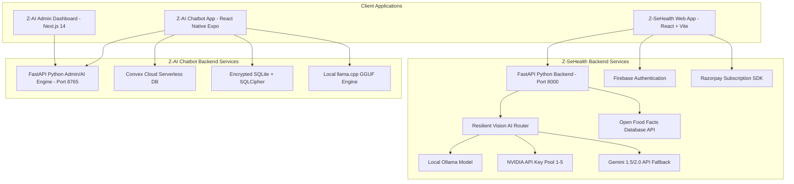

# Master System Reference & Exhaustive Breakdown

This document provides a comprehensive, itemized, and granular technical breakdown of all files, components, data schemas, API routes, algorithms, environment variables, and features across both **Z-SeHealth** and **Z-AI Chatbot** platforms.

---

## 1. System Ecosystem Diagram



---

## 2. Project 1: Z-SeHealth Ecosystem (`z-sehealth.vercel.app`)

### A. Repository Location & Structure
- **Path**: `C:\Farhan Ahmad\Code Languages\Mr. Z\Anti Gravity\Z-SeHealth`
- **GitHub Repository**: [`farhanahmad2106-cpu/Z-SeHealth`](https://github.com/farhanahmad2106-cpu/Z-SeHealth.git)
- **Live Deployment**: [`https://z-sehealth.vercel.app`](https://z-sehealth.vercel.app)

---

### B. Exhaustive File Breakdown & Responsibilities

#### 1. Frontend Files (`frontend/src/`)
- [`App.tsx`](file:///C:/Farhan%20Ahmad/Code%20Languages/Mr.%20Z/Anti%20Gravity/Z-SeHealth/frontend/src/App.tsx):
  - Primary route switcher (`Dashboard`, `Search`, `Scan`, `Profile`, `Settings`, `Pricing`).
  - Custom Event listeners for `z-payment-success` and `z-payment-failure`.
- [`components/Dashboard.tsx`](file:///C:/Farhan%20Ahmad/Code%20Languages/Mr.%20Z/Anti%20Gravity/Z-SeHealth/frontend/src/components/Dashboard.tsx):
  - Daily Nutrients Overview (`2000 kcal` Goal, `140g` Protein, `250g` Carbs, `70g` Fat).
  - Quick Scan Live Camera container with animated viewfinder brackets and photo capture.
  - Active Dietary Safety Profile summary card (Keto, Vegan, Allergies).
  - Embedded `<InteractiveQuoteCard userStreakDays={streak} />`.
- [`components/LandingLoadingOverlay.tsx`](file:///C:/Farhan%20Ahmad/Code%20Languages/Mr.%20Z/Anti%20Gravity/Z-SeHealth/frontend/src/components/LandingLoadingOverlay.tsx):
  - Full-screen loading overlay & standalone `<InteractiveQuoteCard />`.
  - Category badges (`WELLNESS`, `HEALTH`, `MINDSET`, `PERSEVERANCE`).
  - Cooldown rule badge (`⏳ Cooldown Rule: {3*i} Days (View #{i})`).
  - 7-second animated CSS progress bar.
  - Interactive buttons (`Save Quote`, `Next Quote`, `Saved Deck`).
  - Glassmorphic Saved Deck Modal dialog.
  - Shimmer skeleton card placeholders.
- [`quotesData.ts`](file:///C:/Farhan%20Ahmad/Code%20Languages/Mr.%20Z/Anti%20Gravity/Z-SeHealth/frontend/src/quotesData.ts):
  - Curated database of 12 motivational health & mindset quotes (`q1` through `q12`).
- [`quoteEngine.ts`](file:///C:/Farhan%20Ahmad/Code%20Languages/Mr.%20Z/Anti%20Gravity/Z-SeHealth/frontend/src/quoteEngine.ts):
  - `localStorage` key `z_sehealth_quote_history`.
  - Mathematical Cooldown Formula: $D(i) = 3 \times i \text{ days}$.
  - Functions: `getQuoteHistory()`, `saveQuoteHistory()`, `isQuoteEligible()`, `getNextQuote()`, `markQuoteAsDisplayed()`, `toggleSaveQuote()`, `getSavedQuotes()`.
- [`components/Scan.tsx`](file:///C:/Farhan%20Ahmad/Code%20Languages/Mr.%20Z/Anti%20Gravity/Z-SeHealth/frontend/src/components/Scan.tsx):
  - Image upload & camera capture for AI food label recognition.
  - Ingredient parsing, macro estimation, safety warnings, and allergen flags.
- [`components/Search.tsx`](file:///C:/Farhan%20Ahmad/Code%20Languages/Mr.%20Z/Anti%20Gravity/Z-SeHealth/frontend/src/components/Search.tsx):
  - Text search proxy against Open Food Facts API.
  - Macro break-downs and instant meal logging.
- [`components/Profile.tsx`](file:///C:/Farhan%20Ahmad/Code%20Languages/Mr.%20Z/Anti%20Gravity/Z-SeHealth/frontend/src/components/Profile.tsx):
  - User health preferences (Diets: Keto, Vegan, Halal, Gluten-Free).
  - Allergy checkboxes (Peanuts, Dairy, Soy, Shellfish, Eggs).
  - Daily calorie & macro target goal editor.
- [`components/PricingPage.tsx`](file:///C:/Farhan%20Ahmad/Code%20Languages/Mr.%20Z/Anti%20Gravity/Z-SeHealth/frontend/src/components/PricingPage.tsx), [`UpgradeModal.tsx`](file:///C:/Farhan%20Ahmad/Code%20Languages/Mr.%20Z/Anti%20Gravity/Z-SeHealth/frontend/src/components/UpgradeModal.tsx), [`SubscriptionBadge.tsx`](file:///C:/Farhan%20Ahmad/Code%20Languages/Mr.%20Z/Anti%20Gravity/Z-SeHealth/frontend/src/components/SubscriptionBadge.tsx):
  - Subscription tier displays (`free`, `starter`, `pro`, `elite`).
  - Scan usage indicator (`20` free scans limit).
  - Razorpay SDK modal integration.
- [`context/AuthContext.tsx`](file:///C:/Farhan%20Ahmad/Code%20Languages/Mr.%20Z/Anti%20Gravity/Z-SeHealth/frontend/src/context/AuthContext.tsx):
  - Firebase Authentication provider (Email/Password, Google Auth).
- [`context/UserProfileContext.tsx`](file:///C:/Farhan%20Ahmad/Code%20Languages/Mr.%20Z/Anti%20Gravity/Z-SeHealth/frontend/src/context/UserProfileContext.tsx):
  - Stores user profile preferences and dietary restrictions.
- [`context/UserStatsContext.tsx`](file:///C:/Farhan%20Ahmad/Code%20Languages/Mr.%20Z/Anti%20Gravity/Z-SeHealth/frontend/src/context/UserStatsContext.tsx):
  - SWR Caching (`z_sehealth_cached_user_stats`, `z_sehealth_cached_user_streak`).
  - Pre-populated dummy fallback (`1250 kcal`, `85g protein`, `140g carbs`, `42g fat`).
  - Meal logging functions (`logMeal`, `logMultipleMeals`).
  - 9:00 PM daily browser notification scheduler (`scheduleDailyNotification`).
- [`index.css`](file:///C:/Farhan%20Ahmad/Code%20Languages/Mr.%20Z/Anti%20Gravity/Z-SeHealth/frontend/src/index.css):
  - `@keyframes progressFill { 0% { width: 0%; } 100% { width: 100%; } }`.
  - Tailwind CSS directives and custom scrollbar styles.

---

#### 2. Backend Files & API Endpoints (`backend/`)
- **Framework**: FastAPI (Python 3.11).
- **Key API Routes**:
  - `GET /api/user/stats`: Retrieves user's current daily macros and streak.
  - `POST /api/user/log_meal`: Logs a food item and updates totals.
  - `GET /api/subscription/status`: Retrieves subscription tier, scans used, and limit.
  - `POST /api/subscription/create`: Initiates Razorpay subscription order.
  - `POST /api/scan/analyze`: AI Vision diagnostic pipeline.
  - `GET /api/search/food`: Queries Open Food Facts API database.

---

### C. Complete Data Schemas

#### 1. Nutrition Stats Schema (`UserStats`)
```typescript
interface UserStats {
  calories: number;       // e.g. 1250 kcal
  protein: number;        // e.g. 85g
  carbs: number;          // e.g. 140g
  fat: number;            // e.g. 42g
  last_updated: string;   // ISO 8601 string
}
```

#### 2. Quote Record Schema (`QuoteRecord`)
```typescript
interface QuoteRecord {
  displayCount: number;       // 'i' (1, 2, 3...)
  lastShownTimestamp: number; // Unix timestamp in ms
  isSaved?: boolean;          // Favorited state
}
```

#### 3. Motivational Quote Object (`Quote`)
```typescript
interface Quote {
  id: string;                                                  // 'q1' to 'q12'
  text: string;                                                // Full quote text
  author: string;                                              // Author name
  category: 'health' | 'mindset' | 'perseverance' | 'wellness'; // Category string
}
```

---

### D. Detailed Mathematical Cooldown Formulation

Let $Q$ be a motivational quote.
Let $i$ be the number of times quote $Q$ has been displayed to the user ($i \ge 1$).
Let $T_{\text{lastShown}}$ be the Unix timestamp (in ms) when quote $Q$ was last displayed.
Let $D(i)$ be the required cooldown period in days after the $i$-th display.

$$D(i) = 3 \times i \text{ days} = (3 \times i \times 86,400 \times 1,000) \text{ ms}$$

```
+------------------+-----------------------+---------------------------------------+
| Display Count (i)| Required Cooldown D(i)| Next Re-appearance Eligibility        |
+------------------+-----------------------+---------------------------------------+
| i = 1 (1st View) | 3 * 1 = 3 Days        | Eligible after 3 days (259,200,000 ms)|
| i = 2 (2nd View) | 3 * 2 = 6 Days        | Eligible after 6 days (518,400,000 ms)|
| i = 3 (3rd View) | 3 * 3 = 9 Days        | Eligible after 9 days (777,600,000 ms)|
| i-th View        | 3 * i Days            | Eligible after 3 * i days             |
+------------------+-----------------------+---------------------------------------+
```

---

### E. AI Vision Failover Architecture Matrix

```
[User Uploads Image]
       |
       v
+-------------------------------+
| Step 1: Local Ollama Model    | ---> (Success) ---> [Return Analysis]
+-------------------------------+
       | (Offline / Unavailable)
       v
+-------------------------------+
| Step 2: NVIDIA API Key Pool   | (Rotates NVIDIA_API_KEY_1 to NVIDIA_API_KEY_5)
+-------------------------------+ ---> (Success) ---> [Return Analysis]
       | (Rate Limit 429 / Fail)
       v
+-------------------------------+
| Step 3: Google Gemini API     | ---> (Success) ---> [Return Analysis]
+-------------------------------+
```

---

### F. Environment Variables (`frontend/.env` & `backend/.env`)

```ini
# Frontend Environment Variables
VITE_API_BASE_URL=https://z-sehealth.vercel.app
VITE_FIREBASE_API_KEY=AIzaSy...
VITE_FIREBASE_AUTH_DOMAIN=z-sehealth.firebaseapp.com
VITE_FIREBASE_PROJECT_ID=z-sehealth
VITE_RAZORPAY_KEY_ID=rzp_live_...

# Backend Environment Variables
NVIDIA_API_KEY_1=nvapi-...
NVIDIA_API_KEY_2=nvapi-...
NVIDIA_API_KEY_3=nvapi-...
NVIDIA_API_KEY_4=nvapi-...
NVIDIA_API_KEY_5=nvapi-...
NVIDIA_VISION_MODEL=nvidia/neva-22b
NVIDIA_TEXT_MODEL=meta/llama-3.1-70b-instruct
GEMINI_API_KEY=AIzaSy...
RAZORPAY_KEY_ID=rzp_live_...
RAZORPAY_KEY_SECRET=secret_...
```

---

## 3. Project 2: Z-AI Chatbot Ecosystem

### A. Repository Location & Structure
- **Path**: `c:\Farhan Ahmad\Code Languages\Mr. Z\Anti Gravity\AI Chatbot`
- **GitHub Repository**: [`farhanahmad2106-cpu/z-ai-chatbot`](https://github.com/farhanahmad2106-cpu/z-ai-chatbot.git)

---

### B. Exhaustive File Breakdown & Responsibilities

#### 1. Mobile & Desktop App (`src/`)
- [`App.tsx`](file:///c:/Farhan%20Ahmad/Code%20Languages/Mr.%20Z/Anti%20Gravity/AI%20Chatbot/App.tsx):
  - React Native entry point, Drawer & Stack navigation setup.
- [`src/screens/DashboardScreen.tsx`](file:///c:/Farhan%20Ahmad/Code%20Languages/Mr.%20Z/Anti%20Gravity/AI%20Chatbot/src/screens/DashboardScreen.tsx):
  - Real-time System Telemetry dashboard.
  - Active Loaded AI Runtime Model indicator.
  - CPU Cores Capacity progress bar.
  - System Memory (RAM) & SSD Storage capacity segmented progress bars.
- [`src/screens/ChatHomeScreen.tsx`](file:///c:/Farhan%20Ahmad/Code%20Languages/Mr.%20Z/Anti%20Gravity/AI%20Chatbot/src/screens/ChatHomeScreen.tsx):
  - Primary offline conversation interface with text streaming.
- [`src/screens/ModelsScreen.tsx`](file:///c:/Farhan%20Ahmad/Code%20Languages/Mr.%20Z/Anti%20Gravity/AI%20Chatbot/src/screens/ModelsScreen.tsx):
  - Local GGUF quantized model manager (download, load to RAM, unload).
- [`src/stores/useTelemetryStore.ts`](file:///c:/Farhan%20Ahmad/Code%20Languages/Mr.%20Z/Anti%20Gravity/AI%20Chatbot/src/stores/useTelemetryStore.ts):
  - Polling store fetching system performance metrics from local Python engine.

---

#### 2. Convex Cloud Synchronization (`convex/`)
- [`convex/schema.ts`](file:///c:/Farhan%20Ahmad/Code%20Languages/Mr.%20Z/Anti%20Gravity/AI%20Chatbot/convex/schema.ts):
  ```typescript
  export default defineSchema({
    conversations: defineTable({
      userId: v.string(),
      title: v.string(),
      model: v.string(),
      createdAt: v.number(),
      updatedAt: v.number(),
    }).index("by_user", ["userId"]),

    messages: defineTable({
      conversationId: v.id("conversations"),
      role: v.union(v.literal("user"), v.literal("assistant"), v.literal("system")),
      content: v.string(),
      timestamp: v.number(),
    }).index("by_conversation", ["conversationId"]),
  });
  ```
- [`convex/conversations.ts`](file:///c:/Farhan%20Ahmad/Code%20Languages/Mr.%20Z/Anti%20Gravity/AI%20Chatbot/convex/conversations.ts): Queries and mutations for managing user threads.
- [`convex/messages.ts`](file:///c:/Farhan%20Ahmad/Code%20Languages/Mr.%20Z/Anti%20Gravity/AI%20Chatbot/convex/messages.ts): Queries and mutations for appending and fetching thread turns.

---

#### 3. Admin Portal (`admin-dashboard/`)
- [`admin-dashboard/src/app/page.tsx`](file:///c:/Farhan%20Ahmad/Code%20Languages/Mr.%20Z/Anti%20Gravity/AI%20Chatbot/admin-dashboard/src/app/page.tsx):
  - Brutalist dark UI admin portal.
  - SWR caching (`z_sehealth_cached_summary`, `z_sehealth_cached_flags`) and `LandingLoadingOverlay` integration.
  - Authorization check using header `X-Admin-Key`.
  - Feature Flag Creator and Switcher (`quick_health_scan`, `daily_motivational_deck`).
  - System Telemetry Warning Logs viewer.
- [`admin-dashboard/src/app/LandingLoadingOverlay.tsx`](file:///c:/Farhan%20Ahmad/Code%20Languages/Mr.%20Z/Anti%20Gravity/AI%20Chatbot/admin-dashboard/src/app/LandingLoadingOverlay.tsx):
  - Interactive Quote Deck overlay for admin portal.
- [`admin-dashboard/src/app/quoteEngine.ts`](file:///c:/Farhan%20Ahmad/Code%20Languages/Mr.%20Z/Anti%20Gravity/AI%20Chatbot/admin-dashboard/src/app/quoteEngine.ts) & [`quotesData.ts`](file:///c:/Farhan%20Ahmad/Code%20Languages/Mr.%20Z/Anti%20Gravity/AI%20Chatbot/admin-dashboard/src/app/quotesData.ts):
  - Cooldown rotation engine enforcing $3 \times i$ days logic.

---

## 4. Master Feature Comparison & Status Matrix

```
+------------------------------------+--------------------------+-----------------------+-------------------------+
| Feature Component                  | Target Project           | Technical Implementation| Verification Status    |
+------------------------------------+--------------------------+-----------------------+-------------------------+
| Instant SWR Cache (0ms render)     | Z-SeHealth & Admin       | LocalStorage + SWR    | 🟢 Verified & Live      |
| Pre-populated Dummy Data Fallback  | Z-SeHealth & Admin       | UserStatsContext      | 🟢 Verified & Live      |
| Interactive Quote Deck Widget      | Z-SeHealth Dashboard     | InteractiveQuoteCard  | 🟢 Verified & Live      |
| 7-Second Progress Bar Auto-Rotate  | Z-SeHealth & Admin       | CSS @keyframes        | 🟢 Verified & Live      |
| Quote Cooldown Math (3*i Days)     | Z-SeHealth & Admin       | quoteEngine.ts        | 🟢 Verified & Live      |
| Save Quote & Saved Deck Modal      | Z-SeHealth & Admin       | React Modal + Storage | 🟢 Verified & Live      |
| Live Camera Viewfinder Quick Scan  | Z-SeHealth Dashboard     | HTML5 Canvas/Video API| 🟢 Verified & Live      |
| Multi-Tier AI Vision Failover      | Z-SeHealth Backend       | Ollama -> Nvidia -> Gemini | 🟢 Operational       |
| Open Food Facts Search Proxy       | Z-SeHealth Backend       | HTTPX Proxy           | 🟢 Operational          |
| Razorpay Freemium Subscriptions    | Z-SeHealth Frontend/Back | Razorpay JS SDK       | 🟢 Operational          |
| Local GGUF Model Management        | Z-AI Chatbot Mobile      | llama.cpp / GGUF      | 🟢 Operational          |
| Convex Cloud Conversation Sync     | Z-AI Chatbot Mobile      | Convex Serverless     | 🟢 Operational          |
| Remote Feature Flags Portal        | Z-AI Admin Dashboard     | Next.js 14 + FastAPI  | 🟢 Verified & Live      |
+------------------------------------+--------------------------+-----------------------+-------------------------+
```
