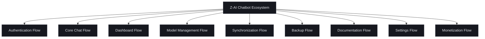
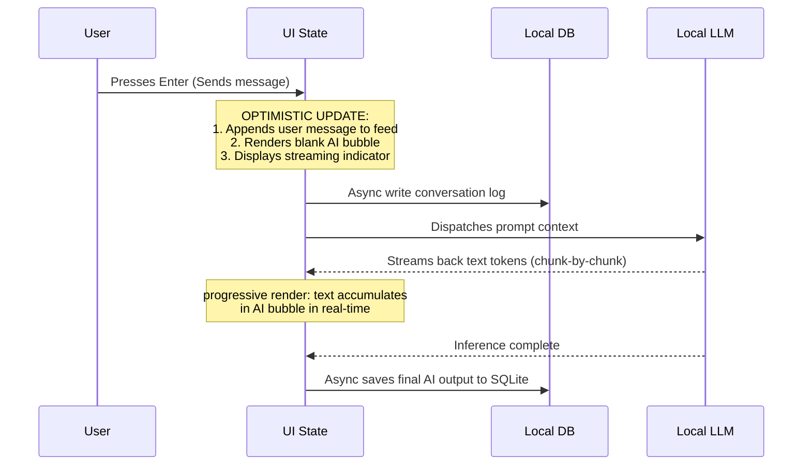
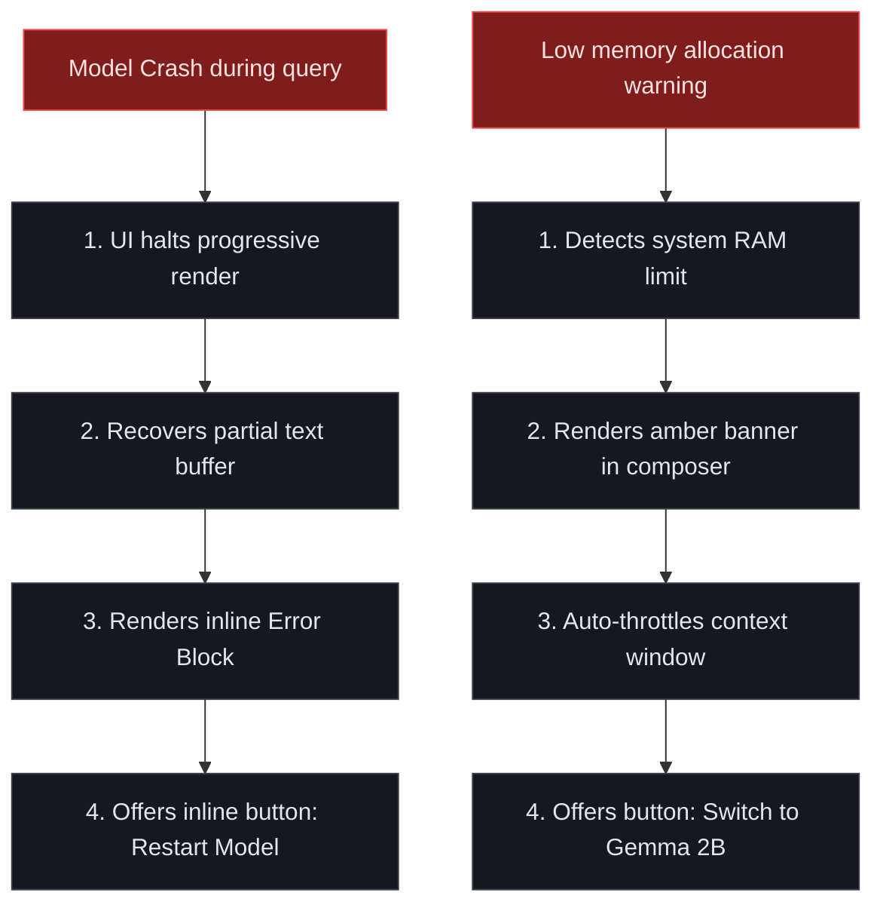

# Z-AI Chatbot V1.0 — UX Screen Breakdown & Interaction Specification

This document outlines the high-fidelity UX architecture, screen layouts, reusable component hierarchies, and interaction behaviors for the **Z-AI Chatbot V1.0** platform. 

The user interface has been designed and initialized in **Stitch** (Project ID: `13559353545155286026`) using a **Minimalist-Brutalist Hybrid Design System** nicknamed **"Quietly Intelligent"**. It prioritizes extreme visual clarity, information density, high-contrast typography, and strict rectilinear structures (0px corner radius) to represent a professional-grade local-first environment.

---

## 1. Global Visual & Interaction Tokens

| Token Category | Value / Behavior | Rationale |
| :--- | :--- | :--- |
| **Color: Workspace Base** | Deep Black (`#0d0e12`) | Minimizes eye strain, recedes into the background, and maximizes text contrast. |
| **Color: Navigation Slate** | Dark Slate (`#16181f`) | Visually anchors sidebars, modals, and persistent elements. |
| **Color: Accents** | Indigo (`#4f46e5`), Emerald Green (`#10b981`), Crimson Red (`#ef4444`) | Indigo for primary CTAs/actions; Green for secure sync/success; Red for memory/hardware errors. |
| **Color: Borders** | 1px Solid Low-Luminance Grey (`#383c4a`) | Defines interface geometry cleanly without the visual noise of drop shadows. |
| **Typography: Headlines** | **Hanken Grotesk** | Tight geometric kerning and clean forms provide a modern, technical aesthetic. |
| **Typography: Body Chat** | **Inter** | Highly readable sans-serif optimized for long-form dialogue and low fatigue. |
| **Typography: Labels/Console** | **JetBrains Mono** | Signals system outputs, coordinates, memory usage, and file sizes. |
| **Corner Geometry** | Strictly Rectilinear (`0px` border-radius) | Clean, clinical appearance that scales perfectly on low-end hardware without GPU rounding overhead. |

---

## 2. Complete Screen Hierarchy List

The Z-AI Chatbot system architecture is organized into **9 distinct operational flows** containing **39 screens and modals**.



### 2.1 Screen Registry & Flow Matrix

| Flow Area | Screen / Component Name | Platform | Description |
| :--- | :--- | :--- | :--- |
| **Authentication** | Splash Screen | Desktop / Mobile | Initial system diagnostics and decryption key validation. |
| | Welcome Onboarding | Desktop / Mobile | Core privacy positioning introduction and key generation. |
| | PIN Creation / Login | Desktop / Mobile | Secure local access screen using OS-level biometric integration. |
| **Core Chat** | Chat Home Screen (Stitch Generated) | Desktop / Mobile | Primary workspace featuring model selector and streaming chat thread. |
| | Search & History Panel | Desktop (Sidebar) | Search indexer for previous conversations with metadata tags. |
| | Citation Inspector Detail | Drawer Panel | Expanding side drawer showing local scraper reference sources. |
| | Export/Import Modal | Dialog Modal | JSON/Markdown backup extraction and local archive importer. |
| **Dashboard** | Main System Monitor | Desktop / Mobile | Grid layout tracking RAM, CPU, sync status, and storage. |
| | Storage Analytics | Detailed Screen | Visual breakdown of database size, cache, and indices. |
| | Performance Metrics | Detailed Screen | Live resource graph monitoring local LLM inference cost. |
| | Achievement Stream | Desktop Sidebar | Streaks, secure-backup milestones, and privacy goals. |
| **Model Manager** | Installed Models | Desktop / Mobile | Local GGUF collection dashboard with load/unload actions. |
| | Import / Download Center | Detailed Screen | Repository catalog for local GGUF, Phi-3, and Gemma imports. |
| | Inference Settings | Detailed Screen | Context length slider, temperature, thread allocations. |
| **Synchronization**| Sync Center | Desktop / Mobile | Peer-to-peer LAN mesh status showing trusted nodes. |
| | Pairing Portal | Desktop / Mobile | Secure pin exchange screen for adding encrypted local devices. |
| | Conflict Resolution Wizard | Desktop / Mobile | Side-by-side CRDT fork comparison to merge divergent logs. |
| **Backup** | Backup Dashboard | Desktop / Mobile | Snapshot catalog, target picker (USB/NAS), and automation. |
| | Restore Wizard | Dialog Modal | Incremental recovery selector with backup integrity verification. |
| **Documentation** | Help Center Home | Desktop / Mobile | Offline-packaged markdown library with local query indexer. |
| | Troubleshooting Wizard | Detailed Screen | Direct system self-diagnostics guide and hardware logs. |
| **Settings** | Configuration Hub | Desktop / Mobile | Multi-category preferences menu. |
| | Security & Keys Panel | Detailed Screen | Master recovery key export, PIN rotation, biometric toggle. |
| **Monetization** | Premium Upgrade Screen | Desktop / Mobile | High-bandwidth relay sync and advanced local model catalog. |

---

## 3. High-Fidelity Screen Specifications

### 3.1 Chat Home Screen (Core Workspace)

Designed and generated in Stitch as a heavy-use, zero-distraction layout.

```text
+------------------------------------+----------------------------------------------------+
|  Z-AI CHATBOT V1.0                 |  Phi-3 Mini (3.8B, Q4_K_M) [v]   [o] Sync Secure   |
|  [o] Node Active: Local            +----------------------------------------------------+
|                                    |                                                    |
|  [ + New Chat ]                    |  USER:                                             |
|                                    |  How do I optimize SQLite memory usage in          |
|  [ Search conversations...   ]     |  WAL mode?                                         |
|                                    |                                                    |
|  RECENTS                           |  AI ASSISTANT (Phi-3 Mini):                        |
|  * Physics Research Notes          |  To optimize local storage performance, run:       |
|  * FastAPI Sync Issue              |  PRAGMA journal_mode = WAL;                        |
|  * Quantization Test               |  PRAGMA cache_size = -2000;                        |
|                                    |                                                    |
|                                    |  [i] Citation Source: local_sql_guide.md           |
|                                    |                                                    |
|                                    +----------------------------------------------------+
|  RESOURCE SUMMARY                  |  [ Attachment ] [ Message Phi-3 (Local)...       ] |
|  CPU: 12%  [=======       ]        |                                                    |
|  RAM: 2.4 / 8.0 GB                 |  [x] Search Web        [v] High Performance  (Send) |
+------------------------------------+----------------------------------------------------+
```

#### Layout Hierarchy (Desktop)
1. **Left Sidebar (280px Grid, Background: `#16181f`, Border-Right: 1px `#383c4a`)**:
   - **Top Cluster:** Logo mark + technical Hanken Grotesk text `Z-AI Chatbot v1.0` + Status indicator row (10px green circle with `Local Node: Active`).
   - **Primary Action Group:** Flat rectangular button `+ New Chat` (Background: `#4f46e5`, sharp corners, white text) + bottom-ruled search input field.
   - **Recent Conversation List:** Simple stack of plaintext titles with inline dates in JetBrains Mono. On hover, background transitions to `#20232d`. An active item has a 3px indigo vertical bar on the left edge.
   - **System Performance Indicator (Pinned Bottom):** Small technical dashboard module displaying system resource labels. CPU usage percentage and a flat horizontal bar graph; RAM usage `2.4 / 8.0 GB` with a similar bar. Icons at the very bottom for quick navigation to Settings and Model Manager.
2. **Main Workspace Area (Background: `#0d0e12`, Text: `#e4e6eb`)**:
   - **Top Navigation Bar:** Left-aligned active model picker (rectangular dropdown displaying GGUF variant in monospaced font). Right-aligned status badge `Sync Secure` (green text + indicator).
   - **Scrollable Chat Thread:**
     - *User Message Bubble:* Clean right-aligned message box, 1px solid stroke `#383c4a` border, transparent background.
     - *Assistant Message Bubble:* Left-aligned response block, solid `#16181f` dark slate fill, no border. Markdown text renders inside with strict line-height spacing (`1.6em`). Code blocks render in a recessed panel with syntax highlighting and a "Copy" CTA.
     - *Citations Card:* Positioned at the bottom of the AI response bubble. A small row of rectangular source tags (e.g. `[1] local_docs/sqlite`) that open the sidebar inspection panel on click.
3. **Floating Composer Panel (Pinned Center Bottom, Max Width: 800px)**:
   - Recessed dark container (`#16181f`) with a top border `#4f46e5` to signal input focus.
   - Multiline text input area (`placeholder: "Message Phi-3 (Local)..."`) with auto-expanding height.
   - **Bottom Tool Strip:** 
     - Left-aligned web scraper toggle: A flat toggle button `[x] Search Web` (displays a subtle blue outline when checked, signifying scraping pipeline is active).
     - Center attachment button: Simple rectangular icon for pairing files or document indexes.
     - Right-aligned send button: Solid indigo arrow button with sharp 0px edges.

---

### 3.2 System Monitor & Analytics Dashboard

Designed as a 2x2 modular dashboard dashboard prioritizing dense performance telemetry.

```text
+-----------------------------------------------------------------------------------------+
| SYSTEM DASHBOARD                                            Last Sync: 2 mins ago [v]   |
+-----------------------------------------------------------------------------+-----------+
| STORAGE ANALYTICS                           | PERFORMANCE ANALYTICS                     |
| Database Size: 1.2 GB / 64 GB Free          | RAM Load: 2.4 GB / 8.0 GB                 |
| Backup Volume: 4.8 GB (USB-Target)          | CPU Usage: 12%                            |
|                                             |                                           |
| Storage Distribution:                       | Inference Speeds (Phi-3 Mini):            |
| [====================---------------------] | [----------------\______________________] |
|   * Chats (400MB)  * Models (800MB)         |   Avg Token/sec: 24 t/s                   |
+---------------------------------------------+-------------------------------------------+
| SYNCHRONIZATION HEALTH                      | OFFLINE ACHIEVEMENTS                      |
| Paired Devices: 2                           | Streak: 5-Day Active                      |
|                                             |                                           |
| * Android Phone   [ Trusted ]  [ Online  ]  | * Privacy Vanguard     [==========] 100%  |
| * Home Desktop    [ Trusted ]  [ Offline ]  | * Backup Sentinel      [=====     ] 50%   |
|                                             |                                           |
| Pending Sync Operations: 0 queue            | Next Goal: Encrypted backup schedule      |
+---------------------------------------------+-------------------------------------------+
```

#### Layout Hierarchy (Desktop)
1. **Dashboard Header Bar:** Left-aligned bold headline `SYSTEM DASHBOARD` in Hanken Grotesk. Right-aligned `Last Sync: 2 mins ago` in green text with a manual sync trigger button.
2. **Telemetry Grid (2x2 Column Reflow)**:
   - **Card A: Storage Analytics (Top Left):** Solid `#16181f` background. Contains numerical details on local disk usage in JetBrains Mono. A single, horizontal multi-segmented bar chart showing the breakdown of chat storage, downloaded LLM models, and local backup snapshots.
   - **Card B: Performance Analytics (Top Right):** Displays real-time RAM and CPU usage percentages. Below is a simple, lightweight canvas-rendered line graph showing memory consumption over the last 10 minutes of active query loops. Shows token generation speed metric `Average: 24 tokens/sec`.
   - **Card C: Synchronization Health (Bottom Left):** Lists paired trusted devices in horizontal rows. Each row contains the device nickname, key signature fingerprint, trust badge, and online/offline status (green chip for online, muted grey for offline).
   - **Card D: Achievements & Privacy Streaks (Bottom Right):** Measures local efficiency. Renders streak count banner `5-Day Active Streak` alongside visual horizontal progress bars mapping milestones like `Privacy Vanguard` (100% of data remains local) and `Backup Sentinel` (regular encrypted backups configured).

---

### 3.3 Installed Models Screen (Model Management)

The hub for loading, unloading, and downloading quantized GGUF models.

```text
+-----------------------------------------------------------------------------------------+
| LOCAL MODEL LIBRARY                                       [ + Import GGUF Model ]       |
+-----------------------------------------------------------------------------------------+
| [x] Loaded  Phi-3 Mini (3.8B)      GGUF  Q4_K_M  [ 2.2 GB ]  ( Unload )  [ Configure ]  |
| [ ] Idle    Mistral 7B (7.3B)      GGUF  Q5_K_S  [ 4.8 GB ]  ( Load )    [ Configure ]  |
| [ ] Idle    Gemma 2B (2.1B)        GGUF  Q4_0    [ 1.4 GB ]  ( Load )    [ Delete ]     |
+-----------------------------------------------------------------------------------------+
| SYSTEM ALLOCATION MATRIX                                                                |
| Available System Memory: 8.0 GB                                                         |
| Active Model Load: [======               ] 2.2 GB (27% allocation)                      |
| Status: Stable (Recommended context threshold: 4096 tokens)                             |
+-----------------------------------------------------------------------------------------+
```

#### Layout Hierarchy (Desktop)
1. **Library Header Bar:** Large bold title `LOCAL MODEL LIBRARY` with right-aligned flat button `[ + Import GGUF Model ]`.
2. **Model Status Rows:**
   - Stacked horizontal cards representing installed GGUFs.
   - Left-hand active indicator checkbox: Checked green box `[x] Loaded` or unchecked grey box `[ ] Idle`.
   - Centered tags: Model Name, parameter size, quantization type, and file size in JetBrains Mono.
   - Right-aligned actions panel: Flat button `Load` or `Unload` + settings shortcut. Hovering over `Delete` turns the text color to crimson red (`#ef4444`).
3. **Memory Allocation Summary (Pinned Bottom)**:
   - Recessed container summarizing VRAM/RAM budgets.
   - Graphical slider representing the percentage of system memory consumed by the currently loaded model.
   - Warning label is triggered dynamically if the loaded model footprint exceeds 75% of available system memory.

---

## 4. Reusable UI Component Library (Quietly Intelligent Theme)

Every component is defined strictly by its flat rectilinear geometry, high typographic contrast, and functional color states.

```text
  DEFAULT STATE             HOVER STATE               DANGER / ERROR
  +-----------------+       +-----------------+       +-----------------+
  |  Primary CTA    |       |  Primary CTA    |       |  Destructive    |
  +-----------------+       +-----------------+       +-----------------+
  Fill: #4f46e5             Fill: #6366f1             Fill: #ef4444
  Border: None              Border: None              Border: None
  Radius: 0px               Radius: 0px               Radius: 0px

  TEXT INPUT FIELD          FOCUSED STATE             ERROR STATE
  +-----------------+       +-----------------+       +-----------------+
  | Enter value...  |       | Enter value...  |       | Invalid PIN...  |
  +-----------------+       +-----------------+       +-----------------+
  Border: #383c4a           Border: #4f46e5           Border: #ef4444
  Background: #0d0e12       Background: #0d0e12       Background: #7f1d1d
```

### 4.1 Button Tokens
*   **Primary Button:** Solid indigo background (`#4f46e5`), `#ffffff` bold text, `0px` radius. On hover, background shifts to `#6366f1`. Focused state adds a 1px solid white outline. Disabled background is `#20232d` with muted grey text.
*   **Secondary Button:** Transparent background, 1px solid outline `#383c4a`, `#e4e6eb` text, `0px` radius. On hover, background transitions to `#16181f` with outline shifting to `#4f46e5`.
*   **Destructive Button:** Solid crimson red (`#ef4444`), `#ffffff` text, `0px` radius. On hover, background transitions to `#f87171`.

### 4.2 Form Input Tokens
*   **Text/PIN Fields:** Solid obsidian black (`#0d0e12`) fill, 1px solid stroke `#383c4a` border, `0px` radius. On focus, border changes to `#4f46e5` with no shadow. Error state replaces border with `#ef4444` and adds a light red tinted background `#7f1d1d` at 20% opacity.
*   **Status Badges:** Small rectangular pill tags, solid dark slate fill (`#16181f`), 1px border. Text in JetBrains Mono. Green border/text for success (`#10b981`), amber for pending (`#f59e0b`), red for failed/error (`#ef4444`).

---

## 5. Interaction Logic & Optimistic UI Rules

To enforce a responsive local-first feel, the frontend relies on **Optimistic State Management** and immediate tactile transitions.



### 5.1 Local Keyboard Shortcuts (Power-User Access)
*   `Ctrl + N`: Triggers new chat sequence instantly, clearing the composer focus.
*   `Ctrl + K`: Opens global search panel, overlaying the active conversation thread.
*   `Ctrl + M`: Navigates to local Model Manager dashboard screen.
*   `Shift + Enter`: Inserts a standard newline carriage return in the multiline composer.
*   `Enter`: Dispatches current composer text to the local inference queue.

### 5.2 Sync Indicators & Peer Merging
*   **Sync Operation State:** Real-time synchronization events (database merges via CRDT) are represented by a rotating circular sync icon in the top header.
*   **LAN Mesh Offline State:** If LAN connection is lost, the sync badge shifts silently to `Local-Only Mode` (amber tag). No blocker pop-ups are displayed. Queued write operations are stored in an SQLite retry table (`sync_operations`) and processed optimistically upon reconnection.

---

## 6. Comprehensive Empty State Architecture

To ensure the interface remains calm and helpful during initial use or missing resource states, clean rectilinear placeholders are provided.

```text
  NO CONVERSATIONS STATE
  +------------------------------------------------------------+
  |                                                            |
  |                        [ Z-AI ]                            |
  |           Start a Secure Offline Conversation              |
  |     All chat data is encrypted locally using AES-256.       |
  |                                                            |
  |     [ + Start New Chat ]      [ Import Backup JSON ]       |
  |                                                            |
  +------------------------------------------------------------+

  NO MODELS INSTALLED STATE
  +------------------------------------------------------------+
  |                                                            |
  |                       [ Warning ]                          |
  |                 No active local AI model                   |
  |  An LLM model must be installed to support conversations.  |
  |                                                            |
  |                   [ Open Model Manager ]                   |
  |                                                            |
  +------------------------------------------------------------+
```

### 6.1 State Definitions

| Context Scenario | Visual Layout & Messaging | Primary Call to Action |
| :--- | :--- | :--- |
| **No Conversations** | **Icon:** Potted shield mark.<br>**Headline:** "Start a Secure Offline Conversation"<br>**Body:** "All chat logs are fully encrypted and stored locally on this machine using AES-256." | `[ + Start New Chat ]` (Solid Indigo) and secondary `[ Import Backup JSON ]`. |
| **No Models Installed** | **Icon:** Empty server bracket.<br>**Headline:** "No active local AI model"<br>**Body:** "You need to download or import a quantized GGUF model (like Phi-3 or Gemma) to begin local inference." | `[ Open Model Manager ]` (Solid Indigo). |
| **No Devices Paired** | **Icon:** Unlinked chain link.<br>**Headline:** "Synchronize Securely"<br>**Body:** "Add trusted devices via peer-to-peer LAN mesh connections. No cloud relay required by default." | `[ Pair Trusted Device ]` (Solid Outline). |
| **No Search Results** | **Icon:** Magnifying lens with a dash.<br>**Headline:** "No matching logs found"<br>**Body:** "Verify the search spelling or search across another specific date threshold." | `[ Clear Search Filters ]` (Plain text link). |
| **Empty Analytics** | **Icon:** Bar chart with flat zeros.<br>**Headline:** "Metrics indexing pending"<br>**Body:** "Performance data, VRAM trends, and storage distribution will populate after your first local conversation query." | `[ Start Secure Chat ]` (Solid Indigo). |

---

## 7. Deep-Dive Error State Architecture & Recovery Paths

Error handling in Z-AI Chatbot is designed to prevent data loss, ensure transparent recovery, and provide immediate diagnostic options without relying on continuous internet connectivity.

### 7.1 Emergency Recovery Matrix



### 7.2 Core Error Scenarios & UI Specs

#### 1. Local AI Model Crash (OutOfMemory or Engine Halt)
*   **Trigger Event:** Quantized model execution fails or halts during token streaming due to high memory demand.
*   **UI Execution:**
    *   Stop progress loader instantly. Keep the partial response already streamed to prevent context loss.
    *   Inject a flat red-ruled banner directly below the final streamed line: `[!] Error: The local AI model has crashed.`
    *   **Recovery Action:** Renders two rectangular buttons inside the banner:
        *   `[ Restart Model ]` (Solid indigo, tries to re-load GGUF context in background).
        *   `[ Select Smaller Model ]` (Transparent, links to Model library).

#### 2. Local Storage Exhausted
*   **Trigger Event:** Local device database partition reports near-zero free space during SQLite transaction.
*   **UI Execution:**
    *   Display a persistent red alert banner at the very top of the application window.
    *   **Headline:** `SYSTEM WARNING: Local storage is nearly full (98% utilized).`
    *   **Body:** `Cannot commit new conversations or synchronize logs. Free up storage to resume.`
    *   **Recovery Action:** Renders a button `[ Manage Storage ]` which loads a specialized dashboard interface showing cache directories, unused heavy model files, and old local backup folders that can be safely purged.

#### 3. Peer-to-Peer Sync Decryption Key Mismatch
*   **Trigger Event:** A paired node attempts to sync logs, but the derived shared secret fails verification due to key rotation.
*   **UI Execution:**
    *   Trigger an offline toast notification on the active screen: `Sync Decryption Failure.`
    *   In the Synchronization Flow panel, mark the specific device row with a flashing red status label `Decryption Error`.
    *   **Recovery Action:** Click on the row to trigger an inline security pop-up:
        *   `The encryption keys for [Home Desktop] do not match. Re-verify pair code?`
        *   CTA Buttons: `[ Re-pair Securely ]` (Opens pairing portal) and secondary `[ Revoke Device Trust ]` (Destructive action).

#### 4. Automated Backup Target Missing
*   **Trigger Event:** Scheduled incremental backup fails because target USB drive or local NAS mount directory is not mounted.
*   **UI Execution:**
    *   The background APScheduler job logs a failure state.
    *   The Bottom Sidebar resource tray settings icon displays a small red warning badge.
    *   Clicking the badge opens a drawer panel showing backup failure logs.
    *   **Recovery Action:** Displays option: `[ Select New Target Path ]` (Opens OS file explorer) or `[ Run Manual Backup ]` (Triggers backup script upon target re-connection).

---

## 8. UX Spec Summary Checklist for Developers

- [ ] All borders must utilize exactly `1px solid #383c4a` rules.
- [ ] Absolutely zero corner rounding (`border-radius: 0px`) across all frames, inputs, cards, and buttons.
- [ ] Ensure Hanken Grotesk is loaded for headlines, Inter for paragraph bodies, and JetBrains Mono for metrics and console lines.
- [ ] Incorporate optimistic rendering for message send triggers (user bubble is generated instantly before the FastAPI endpoint resolves).
- [ ] Auto-throttle animation rendering when OS-level reduced motion preference is active.
